## Self-Similarity Priors: Neural Collages as Differentiable Fractal Representations

[**paper**](https://arxiv.org/abs/2204.07673#:~:text=Self%2DSimilarity%20Priors%3A%20Neural%20Collages%20as%20Differentiable%20Fractal%20Representations,-Michael%20Poli%2C%20Winnie&text=Many%20patterns%20in%20nature%20exhibit,described%20via%20self%2Dreferential%20transformations.) **|** [**code**](https://github.com/ermongroup/self-similarity-prior) **|** [**demo**](https://huggingface.co/spaces/Zymrael/Neural-Collage-Fractalization) **|** [**colab**](https://colab.research.google.com/drive/19SMWkp8y_2grg_wRyzi_F1IvMgN5mShi?usp=sharing) **|** [**tweet**](https://twitter.com/MichaelPoli6/status/1535442192424022016)

Representing **data** as the **parameters** of an **iterative map**.
Given a set of parameters, the data is recovered as the (unique) fixed-point of the map.

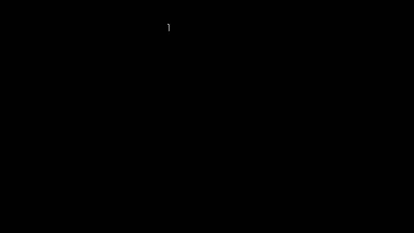

## Overview

Many patterns in nature exhibit self–similarity. This property is common in natural and artificial objects, such as molecules, shorelines, galaxies and even images. In this work, we develop a method to learn representations that are designed to maximally leverage self-similarity, both across regions of a single datum as well as across datasets. Intuitively, they can therefore be efficiently described via self–referential transformations.

We propose to represent data as the parameters of a contractive, iterative map defined on partitions of the data space: the **collage operator**. Instead of performing an extensive search for the set of parameters corresponding to each element, we use a neural network encoder to amortize the cost to a single forward pass. We refer to the encoder and collage operator together as a **Neural Collage**.

We investigate how to leverage collage representations produced by Neural Collages in various tasks, including generation and compression. Neural Collages are orders of magnitude faster than other self–similarity–based image compression algorithms during encoding and offer compression rates competitive with other deep implicit methods. We showcase further applications of Neural Collages as a method to produce fractal art.


## Intuition: Representations of Data

Data can be represented in a variety of ways: in the original space, via a collection of values (e.g. pixels), as a set of coefficients and bases functions (e.g. Fourier coefficients and complex exponentials), or implicitly as the parameters of a map (e.g. pixel locations to pixel values).

Although the standard representation in deep learning is as a composition of learned transformations on data, converging on a “good” representation of the input is often the key approach behind achieving various performance gains and more parameter efficient models. For example, consider Transformers, diffusion models, implicit neural representations ([SIREN](https://www.vincentsitzmann.com/siren/), [NeRF](https://www.matthewtancik.com/nerf), [COIN](https://arxiv.org/abs/2103.03123)) or frequency-domain models ([FNOs](https://arxiv.org/abs/2010.08895), T1). To different extents, these models all rely on some form of preprocessing / augmentation over the inputs and their domains (e.g., grids of pixel locations). The design space therefore involves some parametrization of the input domains, addition of positional encoding schemes, and choice of frequency-domain transforms.

## Data as Contractive Maps

In this work we investigate a different class of representations where a data point is described via the parameters of a function that converges to it, immaterial to the initial condition. In particular, we consider contractive functions that by construction require a small number of parameters: collage operators. Decoding (i.e. parameters to data) is done by applying a collage operator to convergence, also known as solving for its fixed-point. Encoding (i.e. data to parameters) is solved via a neural network trained to produce collage parameters corresponding to data.

A **Neural Collage** consists of both a neural network encoder and a collage operator as decoder.

### Example

Consider a regression problem where a two-dimensional vector $x\in \mathbb R^2$ happens to be of interest for some downstream task. Rather than representing this vector directly, we can use the parameters $\omega$ of a contractive map with $x$ as its fixed-point.

Take a simple affine function to define such a map:
$x_{k+1} = a \circ x_k + b,\quad |a|< 1$
Given $\omega$, $x$ can be recovered by repeatedly applying (i.e. iterating) the map starting from any arbitrary point $x_k$ on the grid below. This example uses 4 real numbers to recover $x_{k+1}$ instead of just two elements of the vector $x$ – not exactly a gain!

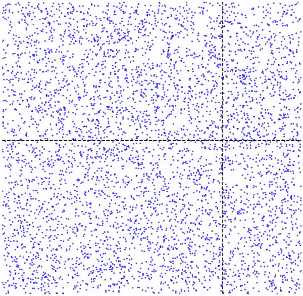

However, we can certainly select other classes of functions that may help reduce the number of required parameters, which is the case of collage operators. Note that these approaches to encoding data are lossy, meaning the original data can only be recovered to a certain degree of accuracy.

## Collage Operator in Code

```python
    def collage_operator(self, z, collage_weight, collage_bias):
        """Collage Operator (decoding). Performs the steps described in  Def. 3.1, Figure 2."""
    
        # Split the current iterate `z` into source patches according to the partitioning scheme.
        domains = img_to_patches(z)
    
        # Pool domains (pre augmentation) to range patch sizes.
        pooled_domains = self.pool(domains) 
    
        # If needed, produce additional candidate source patches as augmentations of existing domains.
        # Auxiliary learned feature maps / patches are also introduced here.
        if self.n_aug_transforms > 1:
            pooled_domains = self.generate_candidates(pooled_domains)
    
        pooled_domains = repeat(pooled_domains, 'b c d h w -> b c d r h w', r=self.num_ranges)
    
        # Apply the affine maps to source patches
        range_domains = torch.einsum('bcdrhw, bcdr -> bcrhw', pooled_domains, collage_weight)
        range_domains = range_domains + collage_bias[..., None, None]
    
        # Reconstruct data by "composing" the output patches back together (collage!).
        z = patches_to_img(range_domains)
    
        return z
```

## Properties of Collage Operators

Why choose collage operators?

#### Compact Parameterization

Based on our selection of affine maps (note: other functions may also be selected), Collages can be represented with just two scalar parameters acting on each combination of input and output patches. This work formalizes generalized collage parameters as an instance of an “iterated function system”; please see our paper for further details. In practice, the “scalar” affine map is broadcasted to each pixel of the patch in consideration.

#### Resolution Independence

Since each affine map is broadcasted to all pixels, it maps each source to a range patch via a scalar multiple that is independent of the resolution or the dimensions of the patch being transformed. This allows the collage operator to be applied in a resolution-agnostic manner.

The mosaic, fractal-like details introduced in higher resolution images reflect the structure of the collage operator: when an entire image (particularly of high enough resolution) is supplied as an input patch, observe that multiple levels of “fractalness” take effect.

#### Unique Fixed-Point

Each set of collage parameters ( \omega ) decodes to a fixed-point that identifies a unique datum. Contractivity can be easily enforced through constraining each affine map between input and output patches.

#### Efficient Training

A Neural Collage encoder can be trained to produce collage parameters via a reconstruction objective. Classical results on contraction maps provide a method to upper bound the distance between input data and fixed-point of a collage by a single collage operator step, rather than by solving explicitly for the fixed-point.

## On Patch-ification

Partitioning schemes directly affect the size of the representation: larger patches yield shorter parameterizations, but at a loss in accuracy.

Below, we show the decoding steps of a collage operator:

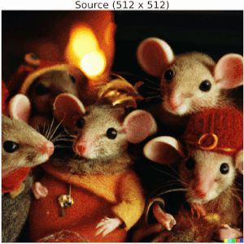

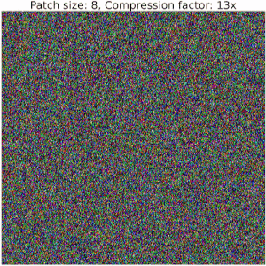

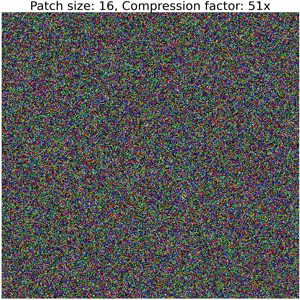


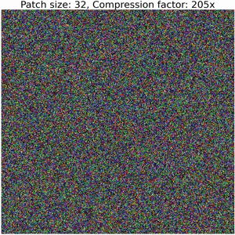

Increasing the size of output patches reduces the accuracy and requires a significantly smaller number of floats to represent an image, resulting in high compression ratios (i.e. representation sizes such as number of bytes for original image versus serialized collage parameters) between bits required to serialize the image compared to the corresponding collage parameters. Refer to the [colab](https://colab.research.google.com/drive/19SMWkp8y_2grg_wRyzi_F1IvMgN5mShi?usp=sharing) for details on how to compute these values.

Note that this example does not employ techniques used in our Neural Collage compression experiments, such as introducing auxiliary patches, augmentations, and bit-packing collage parameters.
Thanks to DALLE-2 for the image!

## Applications

We show how collage parameter representations obtained through Neural Collages can be used in learning tasks.

### Generative Models

We train deep generative models (VDVAEs) with collage parameters as latent variables. The ELBO is computed on the decoded images from the collage operator, given a sample of collage parameters. Collage parameter representations are “rate efficient” and generally significantly smaller than data dimensionality, resulting in generative models that may be easier to optimize.

Regardless of the image size used during training, incorporating Neural Collages in a generative model allows sampling (decoding an image from a sample of collage parameters) at arbitrary resolution. Note that the perceptual artifacts introduced by the upsampling procedure depend on the collage operator type: for example, using augmentation transforms to produce auxiliary patches from domain patches at each iteration may result in details of different effects including reconstructions with rotations or flips.

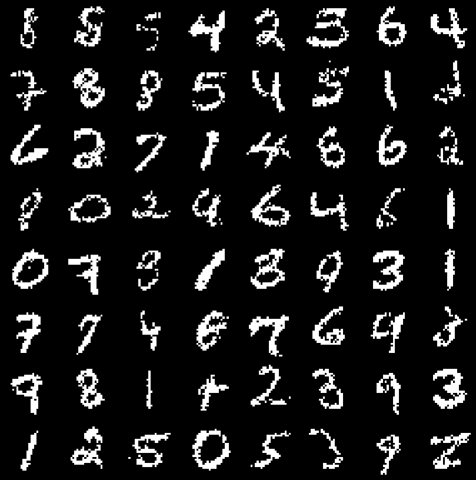


### Image Compressors

We train Neural Collages on a random crops dataset of high-resolution aerial images. At test time, we use this pre-trained encoder to compress images of different resolutions through independent application on each crop. Compression also only requires a single forward pass of a Neural Collage encoder, giving us several orders of magnitude in speedups over fractal compression and COIN.

To leverage similarity across an entire dataset, we introduce auxiliary input patches into a collage iteration (refer to the “generate candidates” step in code). Better compression ratios are achieved by regularizing the collage parameters to assume small values, followed by a bit-packing step.

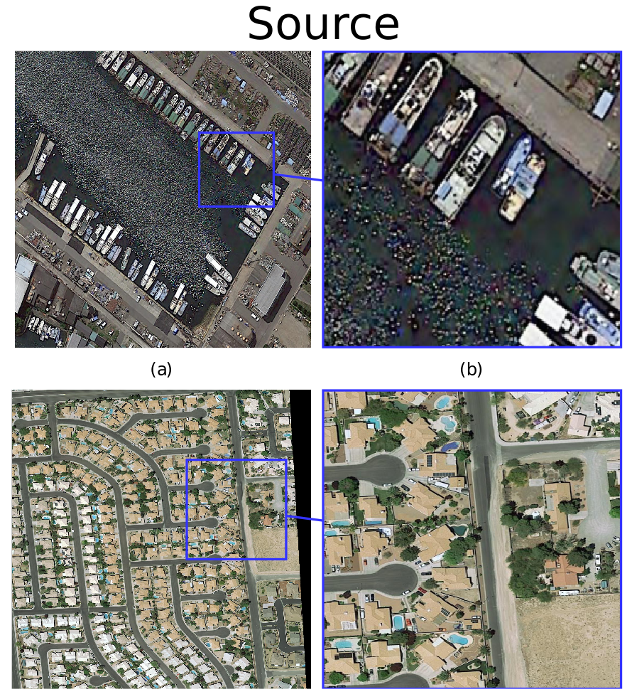

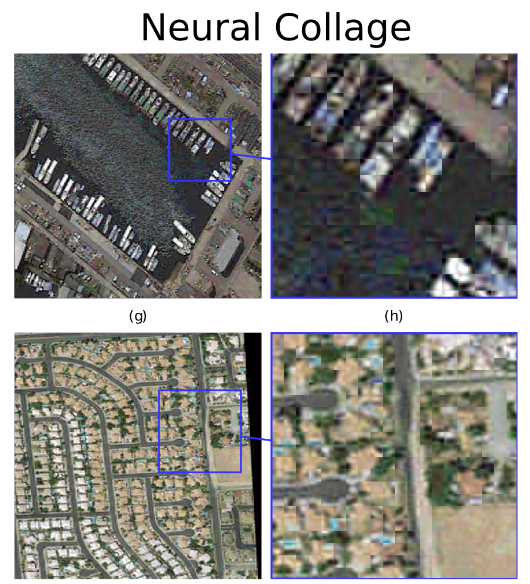

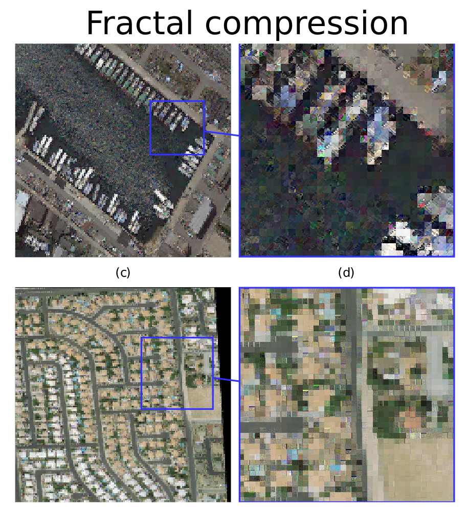

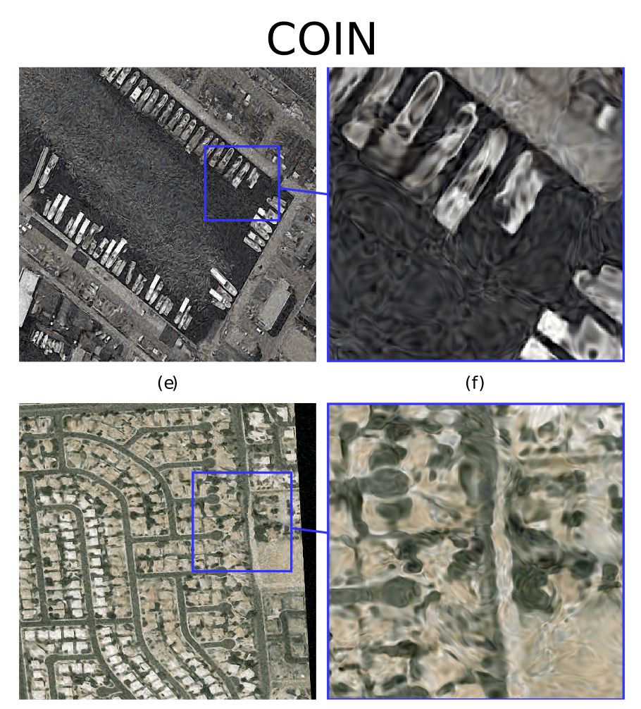

### Creative Applications

Neural Collages can fractalize images (check out our [Gradio](https://huggingface.co/spaces/Zymrael/Neural-Collage-Fractalization) demo). To obtain this fractal effect on your images, train a restricted Neural Collage without source domain partitioning on a reconstruction objective i.e. the entire source image is the one and only input patch. Fractalizing via finetuning takes less than a minute on a single GPU. See the [colab](https://colab.research.google.com/drive/19SMWkp8y_2grg_wRyzi_F1IvMgN5mShi?usp=sharing) tutorial for more details!

## Fractal Compression

Neural Collages are inspired by Partitioned Iterated Function Systems (PIFS), the backbone of fractal compression schemes. Our official implementation includes a GPU-accelerated version of the PIFS algorithm (without quadtrees), serving as a baseline for the image compression experiments. Refer to the main paper for a detailed account of the history of fractal compression and its main variants.

And yes, Neural Collages can be applied to point clouds (as the first IFSs of Barnsley et al.) to produce “true” fractals!

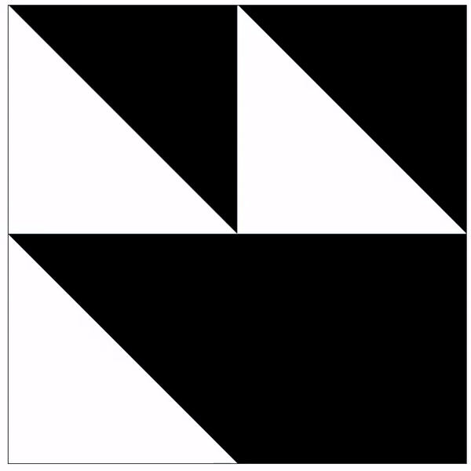

## Conclusion

There are so many questions left open for further investigation. We are looking forward to exploring improved partitioning schemes, Neural Collages for other data modalities, training deep models directly on collage representations, and ways to control the introduction of details when upsampling.

If this work is interesting, please feel free to cite:

```
@article{poli2022self,
        title={Self-Similarity Priors: Neural Collages as Differentiable Fractal Representations},
        author={Poli, Michael and Xu, Winnie and Massaroli, Stefano and Meng, Chenlin and Kim, Kuno and Ermon, Stefano},
        journal={arXiv preprint arXiv:2204.07673},
        year={2022}
      }
```

#### Acknowledgements

This blog was written jointly with Michael Poli.
Thanks to Stefano Ermon, Stefano Massaroli, Jascha Sohl-Dickstein, and David Duvenaud for feedback and discussion on earlier drafts of this post.


