A year ago there were these cheap tickets for a roundtrip to Tanzania that I found. I booked them  with some friends I barely knew besides the fact that we thought similarly about the deal. In retrospect, this probably wasn't the most responsible decision given the incredibly crazy timing and things happening in my life during that time. But nonetheless, we did a quick google search and found that the main attractions there were: 1) going on a safari at the Serengeti to Ngorongoro crater, and 2) summiting Mt Kilimanjaro -- the continent's highest freestanding mountain. Between February 1-14, 2023, I did just that.

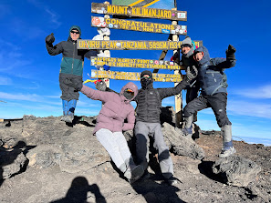

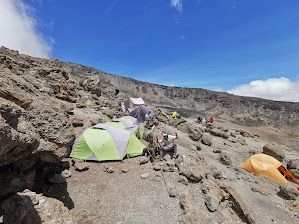

A lot have since asked me about my experiences in Tanzania and why I did such a crazy thing. I have no better answer than maybe that I'm a masochist who loves a good challenge. Besides the challenges to my physical and traveling style, which I'm proud to have overcome and become more accommodating towards, this trip gave me the mind space to reflect deeply (what else would one do without a laptop for 7 days?) and look at the bigger picture, in full gory detail, both in terms of my personal and professional existence.

## journey to the roof of Africa

'Polepole'. This was the phrase we probably said the most besides 'asante'. It's an interesting notion because the idea purported by our local guides and porters (forever indebted to these pals) was that anyone can summit Kilimanjaro if they just 'polepole', or 'take it slowly'. This was particularly hard for me to understand because it would be painful and also simply make no sense for someone to suffer at something they are ill-prepared for. But sometimes you may think you're prepared for the world and end up not.

I've always been the type to prefer 'rakaraka' style, which to me not only signified getting the pain over with quickly but making the most progress or impact out of every second of being alive. This trip to Tanzania, I tried my best to turn off my Slack off the mountain and my Strava while on it. Instead, I thought hard and ascended slowly while pushing through the pain and hypoxia. But these were not the only sources of pain I experienced. I think there were sources more profound that I guess I am glad to have finally faced and compartmentalized.

The day before the overnight summit, my phone flashed upon receiving email notifications, miraculously at 4300m where the air was thin to the point of dropping most of my SPO2 to freakishly low. I opened them in astonishment, followed quickly by disappointment from the content: poking into my sleep-deprived eyes were the rejection emails to doctoral programs and job opportunities that I frankly had expected but foolishly hoped wouldn't actually materialize. It was a weird feeling of loss and feeling lost. The fact that I was able to easily conquer 5985m a few hours later heightened these feelings even more.

I recall the lingering disappointment and pounding in my chest as I attempted to sleep off the mental stress of that day. I ultimately had trouble getting any shut-eye that night so I cracked open my headlamp and started reading the multivariate calculus textbook I brought to improve my mind during the trip. There was definitely some solace found in learning about topology at 5000m, but the distraction wasn't close to enough.

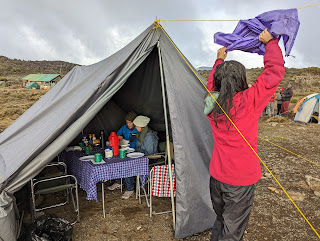

At midnight, we started the ascent. For the first time among all the days I hiked, I dreaded it. The still present knot in my chest was probably more painful than not being able to breathe or eat. For the sake of continuing to be the one who didn't show mental or physical weakness at all, I pretended like I was excited and polepole'd my way up.

## descent to the pineapple Fanta

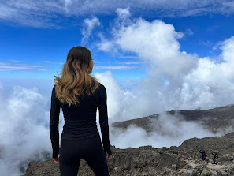

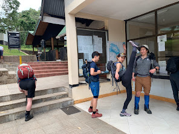

Day 3 at a nice vantage point.Pre-hike sanity check. Kickin' it.

Upon receiving my bachelor's seal of approval, I found that I was a less desirable candidate than my ego had purported. While I had the great fortune of learning from amazing senior researchers at Brain, FAIR, NVIDIA, Cohere, and Stanford, and had taken over a year in extra to build my AI research resume upon abandoning my pre-med aspirations, I still wasn't successful enough to be hired by major AI research labs in industry or academia without extended effort -- particularly now in fighting against credentialism.

To be honest, I started dreading and fearing the work and responsibilities I held, and felt especially embarrassed for disappointing so many who gave me their support and trust. In some ways I was really fortunate to have gotten the opportunities I had as a pre-doctoral student, but now I am forced to realize that I was, at best, an average new university graduate.

Somehow, I am still relatively lucky though. Some great human beings (you know who you are) have been caring enough to snap me out of my lows recently and build up my motivation to try, again. I think I still believe that I can become the researcher I want to be and progress my career along with the constantly shifting field. Wincing slightly less, I reflect on the many papers I contributed to in the past year, the multitude of times I've gotten scooped, and the amount of researchers across so many orgs I've had to unapologetically convince to give me a chance. I love over-analyzing my failures and questioning my abilities, but I guess I am proud to have summited that damn mountain. Unironically, I guess I'm also proud of various aspects of my personal and professional growth while overcoming all the managerial and political pressures that were either beyond my control or that I was unwilling to take too much control of (probably for the better).

I'm going to interpret all of this as growing pains that will hopefully lead to something more harmonious in my rather forked trajectory. It takes time. Whether that's deciding what I really want, or what research question I really want, or if I want to join in on the hype, or if I just want to stick to my grounds. Even if it's slow, I think I'll only get closer to where I want to be if I can think through my options independently and with real confidence. Polepole till the end, and don't forget to star pose along the way.

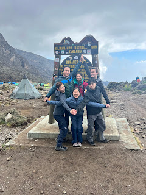

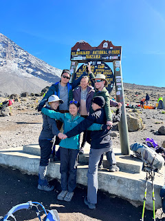

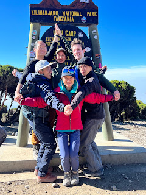

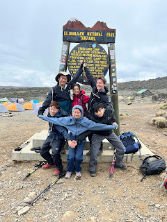

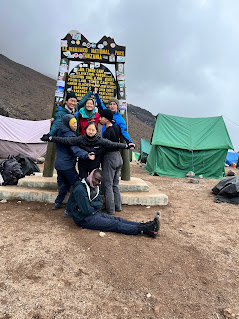

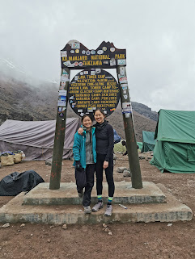

## the real deal

Okay, besides the super meta reflections on life being a moving target that will constantly require repeated attempts before getting right, here are the practical tips you really came for. How does one survive before, during, and after attempting the highest mountain in Africa?

The whole journey took 6 nights and 7 days. Days 1-5 were acclimatization days, this means you ascend the mountain by 500-1000m each day, and alternate elevations to get used to the oxygen levels. Make sure not to overfill your camelbak, it's not necessary, and dress in layers because the rain can hit you anytime. You start your day with black tea and warm water for washing at your tent. Following breakfast with very sour lemons, errr oranges (from the motherland China), the porters will carry your 60L duffel to and from each camp. You'll usually end up at the next day's camp around lunch, and have downtime to explore and bond. You'll traverse a gorgeous set of biomes ranging from tropical rainforest to alpine desert to tundra to glaciers. The 6th day is the summit day where you begin around midnight and go on overnight until 7 AM, seeing the most beautiful sunset over the horizon and above the clouds. Descending takes roughly 2 hours after (quite underwhelming for the amount of struggle felt in ascending), and the final descent back to base camp was 1 whole day. At the base, you get an official certificate if you successfully reach Uhuru peak! Celebrate with some Fanta (it's pineapple flavored there, and it's so much better) and pringles :D

Here are some concrete tips (particularly relevant to the Machame Route):

Make sure you carry a lot of cash in USD or Shillings, and everyone becomes your rafiki / dada / kaka. You might have to tip people a lot under the table in case you get into a sticky (or bloody) situation.

Bring a LifeStraw so that you have unlimited water supply. This will save you a lot of hassle and haggle when the prices for commodities change before your eyes in real time.

Everyone and your mom knows not to let people touch your luggage at the airport or pull your hand towards their taxi. Be aggressive, not passive aggressive.

Tanzania is a predominantly Muslim country. That means no bootie shorts and crop tops in public, except maybe at the beach. Or risk having a scary guy, armed, yell at you.

Gore-tex everything. Patagonia black hole. Osprey backpack. Enough said.

Make sure you take your elevation meds even if you don't feel completely sick. Even if you feel like you're tough and don't need it. Even if you think the British system is superior to the North American one.

Going down the hill is just as hard as going up. I recommend you take a skiing or snowboarding lesson so you know the proper technique and don't kill your sherpa.

Bring enough socks and shirts, or risk borrowing your more well-prepared tent mate's. You will want to change them more often than you plan. Shit gets real dusty beyond 3000m.

Get one, or two, of those Nalgene bottles and fill them up with maji moto each night. You'll stop shivering and have enough RT water to brush your teeth in the morning.

Don't pack your daypack insanely heavily, you're really only hiking 5-7 hours during the nicest parts of the day, and you don't want to unnecessarily offload your crap to your sherpa who's already hauling your asses up.

Bring snacks to share, especially with the locals. They'll find your granola bars and Asian rice crackers super amusing, and you'll make their day!

6:45 AM wake up gets progressively more challenging as you progress, but consistency is key so don't be late or else you slow down the entire group and ruin the porter's plans to beat you to camp.

On summit night make sure to bundle up. I wore 4 layers of socks and had zero issues. Balaclava should be loose, or else you will suffocate because hypoxia is real.

Try to wear two layers of gloves to prevent your hands from getting wrecked by the 70mph winds. Or, just give up on taking amazing photos on your phone.

The feeling of receiving more oxygen on the descent is truly unreal. If you ever feel like giving up just know that some old grandma already beat you to it, so you have no excuse.

Meal times will be the same every day, so calibrate your energy and also expectations for the food. You might want to go vegetarian because there is no such thing as medium rare and juicy tender in this country.

The avocados are the size of your face, bananas cheaper than Whole Foods, and the color of the ketchup is bright pink instead of red, for better or for worse.

Drink lots of moto, it's good for the bowel movements especially at high elevations. Bring a pee bag (we saw others do this) if you're weak and can't brace the high winds at night.

No plastic bags / ziplocs are technically allowed into this country. But yenno, you do what you gotta…

Don't breathe too hard to try and maximize your O2, we're all gonna die anyways.

## Acknowledgements

Asante to the homies for making this trip a real one: Jeff, June, Justin, P. Kidger, Patrick along with the sherpas Walter, Isa, and Moudin. Of course, grateful for all my managers, collaborators, colleagues, and friends from the past year at Brain, FAIR, Cohere, Nvidia, and Stanford for believing in me and teaching me what I know. I owe my career in research to y'all.
